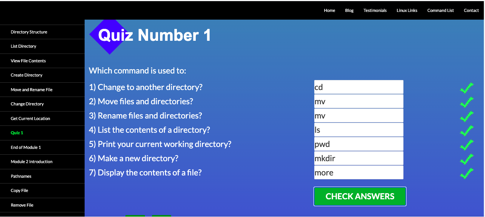
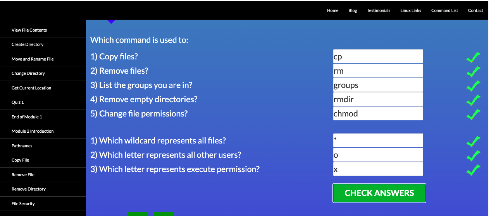
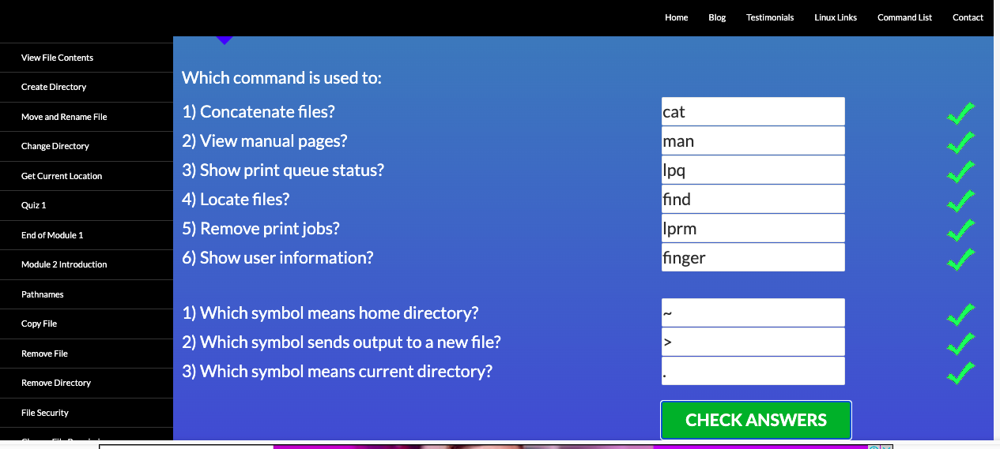
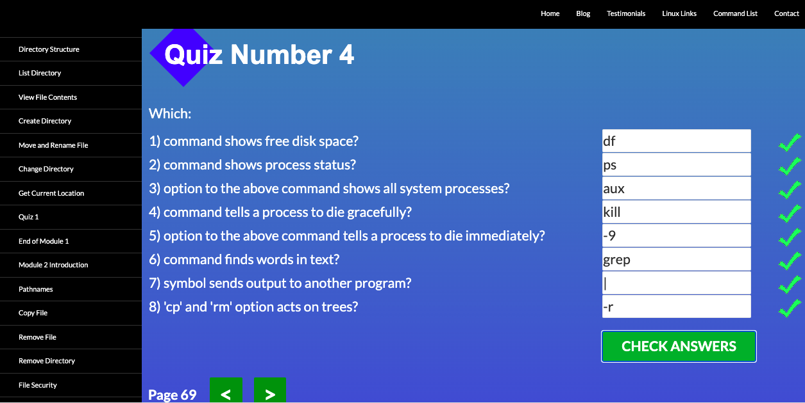

# kottans-frontend
Hello! This repository was created to complete KOTTANS course. I'm Viktoriia Pavliukh, from Kyiv, currently studying Frontend in Hillel IT school.

# Stage 0 (To do list)
- [x] 0. Git basics
- [x] 1. Linux CLI and Networking
- [ ] 2. VCS (hello gitty), GitHub and Collaboration
- [ ] 3. Intro to HTML & CSS
- [ ] 4. Responsive Web Design
- [ ] 5. HTML & CSS Practice
- [ ] 6. JavaScript Basics
- [ ] 7. Document Object Model - practice
- [ ] 8. Building a Tiny JS World (pre-OOP) - practice
- [ ] 9. Object oriented JS - practice
- [ ] 10. OOP exercise - practice
- [ ] 11. Offline Web Applications - optional
- [ ] 12. Memory pair game — real project!
- [ ] 13. Website Performance Optimization - optional
- [ ] 14. Friends App - real project!

_____

## Git basics
I've passed two weeks of coursera [Introduction to Git and GitHub](https://www.coursera.org/learn/introduction-git-github). Everything is new for me in Git, it was very informative to watch these videos. 

I passed [learngitbranching.js.org](learngitbranching.js.org) and finished all nesessary tasks for this level.

## Linux CLI, and HTTP

### Linux Survival (4 modules)
Information was very interesting, I learn a lot of things and hope one day I will use them on practice.
Below you can find print-screen of task succesfully passed:

Quiz 1

Quiz 2

Quiz 3

Quiz 4

### HTTP articles
Definately I'd return later to read again and understand better all information given.

